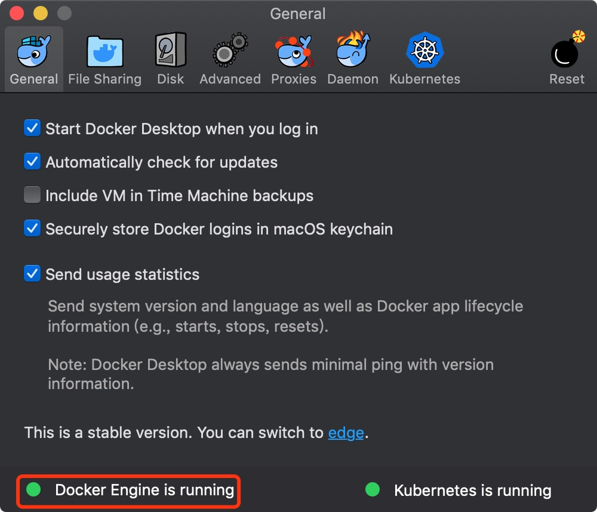
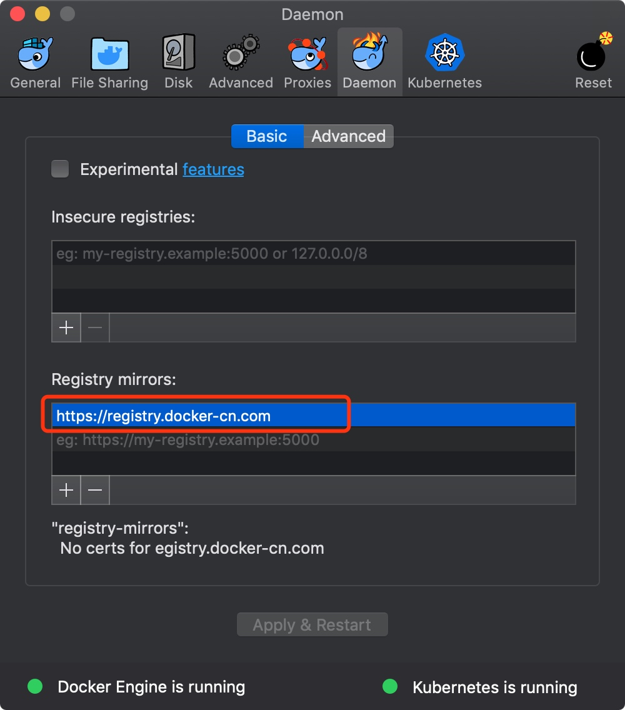
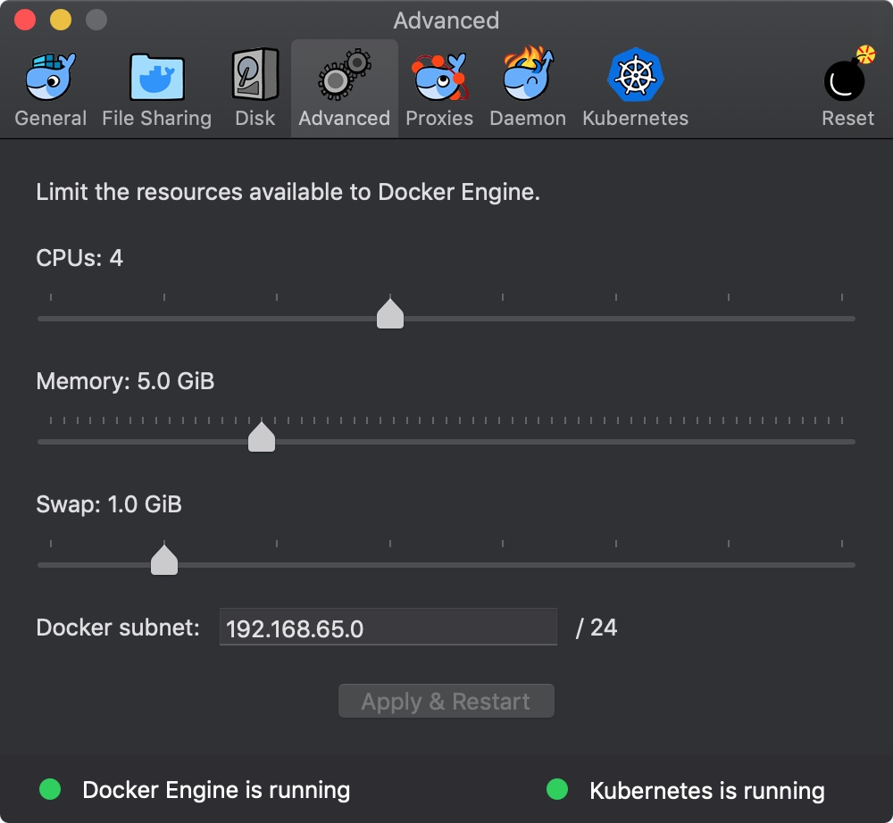
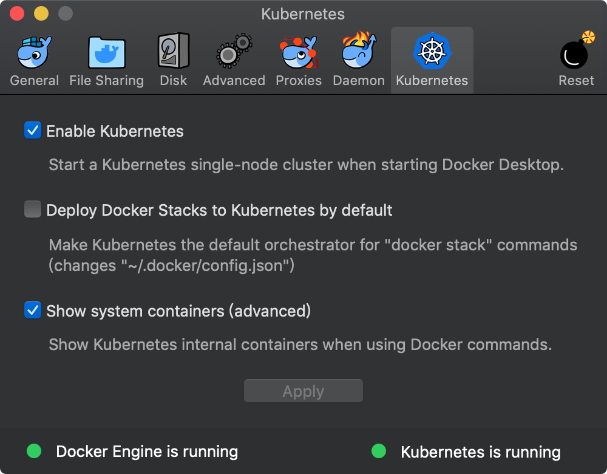
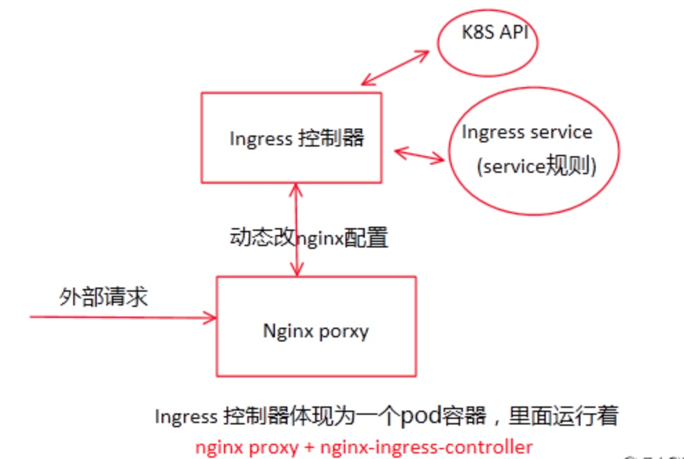

# 安装Docker
1. 下载 Docker CE 最新版本并安装（Docker Desktop（Mac））：https://store.docker.com/search?type=edition&offering=community。安装并运行Docker之后能看到【Docker Engine is running】，暂且看不到【Kubernetes is running】


2. 为Docker开启Kubernetes
1). 为 Docker daemon 配置 Docker Hub 的中国官方镜像加速 https://registry.docker-cn.com

2). 可选操作: 为 Kubernetes 配置 CPU 和 内存资源，建议分配 4GB 或更多内存。

3). 下载 k8s-for-docker-desktop：https://github.com/AliyunContainerService/k8s-for-docker-desktop，然后解压压缩文件，直接运行：./load_images.sh ，开启 Kubernetes，并等待 Kubernetes 开始运行，随后可看到【Kubernetes is running】


# 配置 Kubernetes
1. 验证 Kubernetes 集群状态
>
```
kubectl cluster-info                                            
kubectl get nodes
```
2. 部署 Kubernetes dashboard
> 疑问：dashboard是什么，为什么需要安装之？
> dashboard是座位kubernetes的web用户界面，用户可以通过dashboard在kubernetes集群中部署容器化的应用，对应用进行问题处理和管理，并对集群本身进行管理。通过dashboard，用户可以查看集群中应用的运行情况，同时也能够基于dashboard创建或修改部署、任务、服务等kubernetes的资源。通过部署向导，用户能够对部署进行扩缩容，进行滚动更新、重启Pod和部署新应用。当然，通过dashboard也能够查看kubernetes资源的状态。
下载官方提供的yaml文件：
```
kubectl create -f https://raw.githubusercontent.com/kubernetes/dashboard/master/src/deploy/recommended/kubernetes-dashboard.yaml
```
3. 开启 API Server 访问代理
执行：kubectl proxy
通过 URL 访问 Kubernetes dashboard：http://localhost:8001/api/v1/namespaces/kube-system/services/https:kubernetes-dashboard:/proxy/#!/overview?namespace=default
4. 配置Ingress
> 疑问：Ingress又是啥，为什么要安装之？
> Ingress由两部分组成：Ingress Controller 和 Ingress 服务。 ingress控制器有两种：nginx和haproxy 这里是以nginx为讲解；Ingress Contronler 通过与 Kubernetes API 交互，动态的去感知集群中 Ingress 规则变化，然后读取它，按照自定义的规则，规则就是写明了哪个域名对应哪个service，生成一段 Nginx 配置，再写到 Nginx-ingress-control的 Pod 里，这个 Ingress Contronler 的pod里面运行着一个nginx服务，控制器会把生成的nginx配置写入/etc/nginx.conf文件中，然后 reload 一下 使用配置生效。以此来达到域名分配置及动态更新的问题。看个简单的图方便理解：
> 
安装 Ingress：
```
kubectl apply -f https://raw.githubusercontent.com/kubernetes/ingress-nginx/master/deploy/mandatory.yaml
kubectl apply -f https://raw.githubusercontent.com/kubernetes/ingress-nginx/master/deploy/provider/cloud-generic.yaml
```
